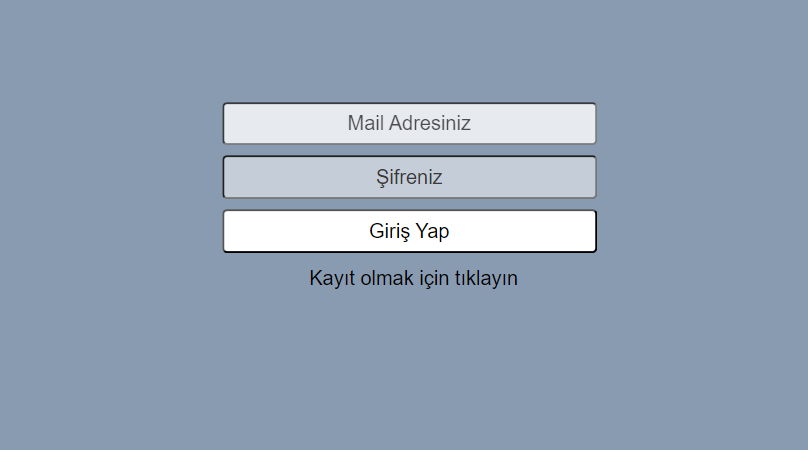
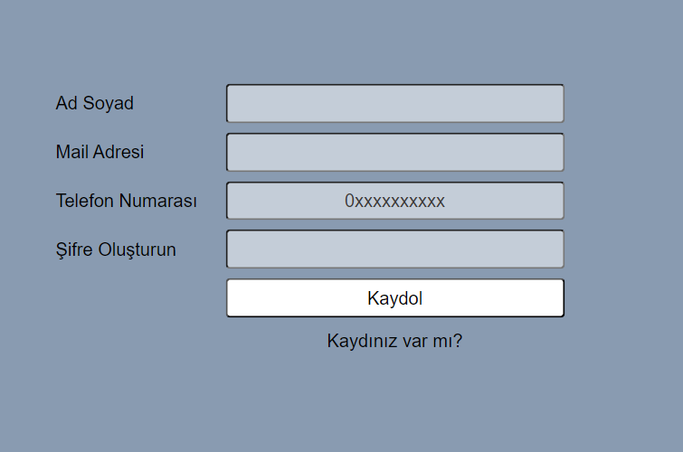
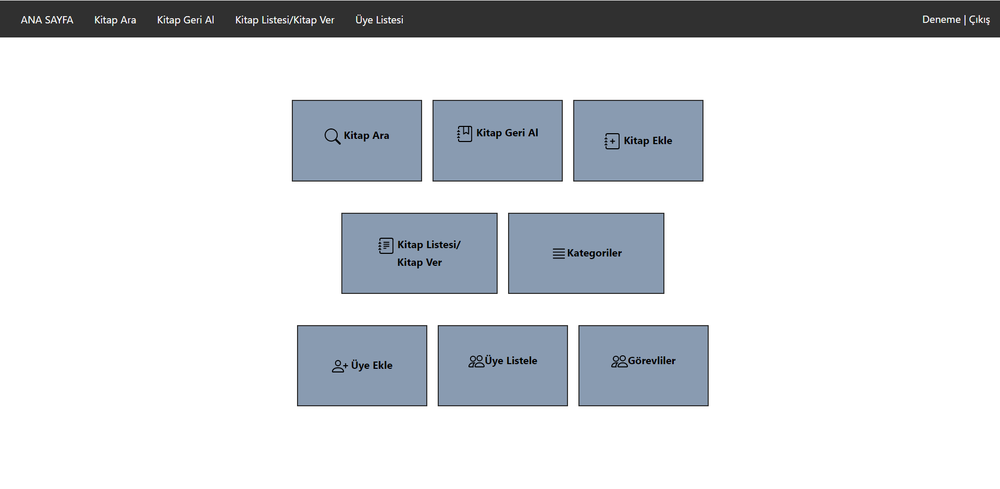
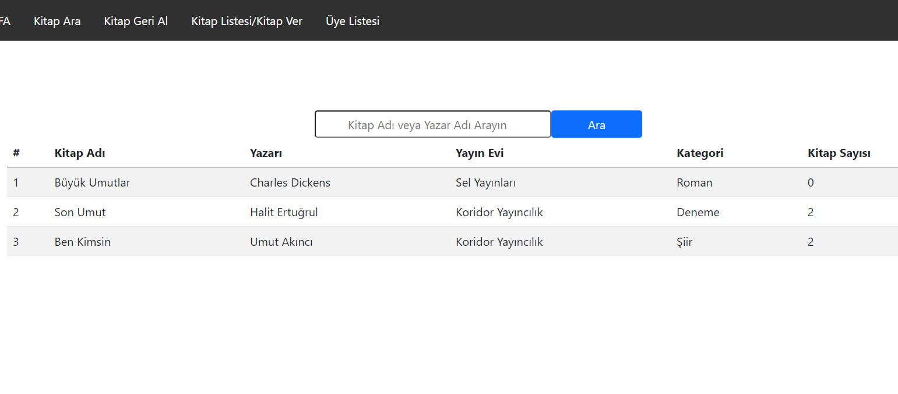
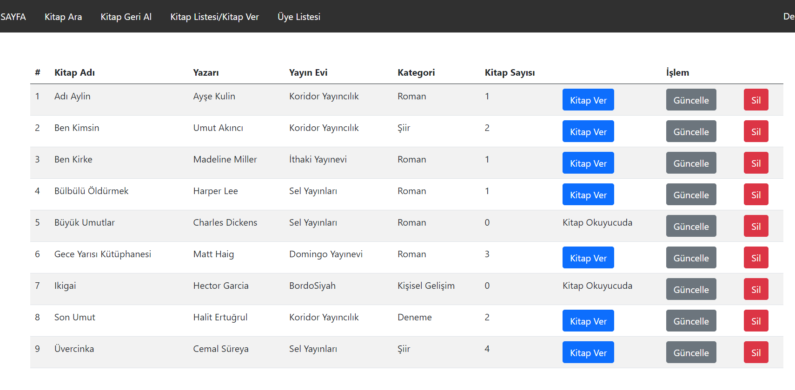
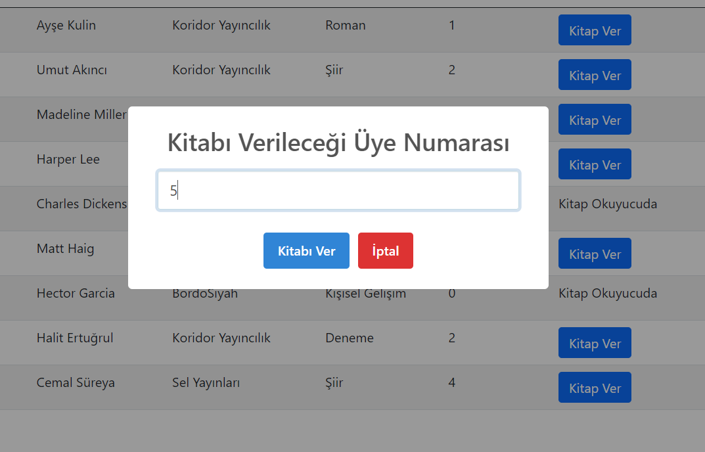
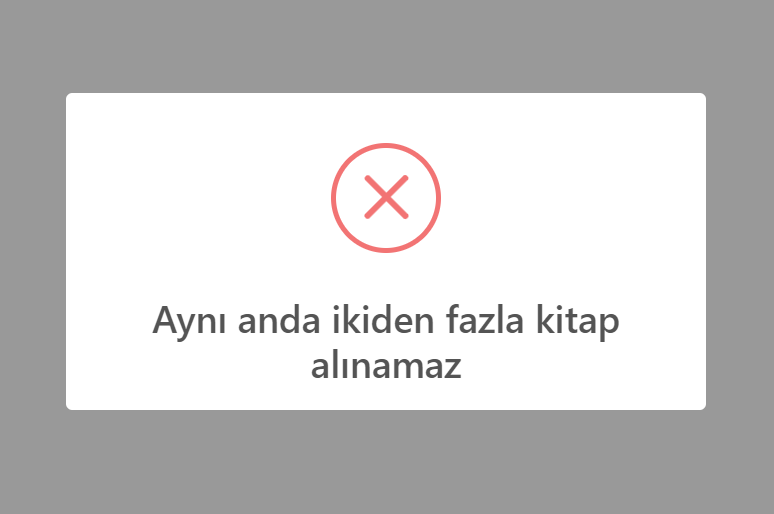
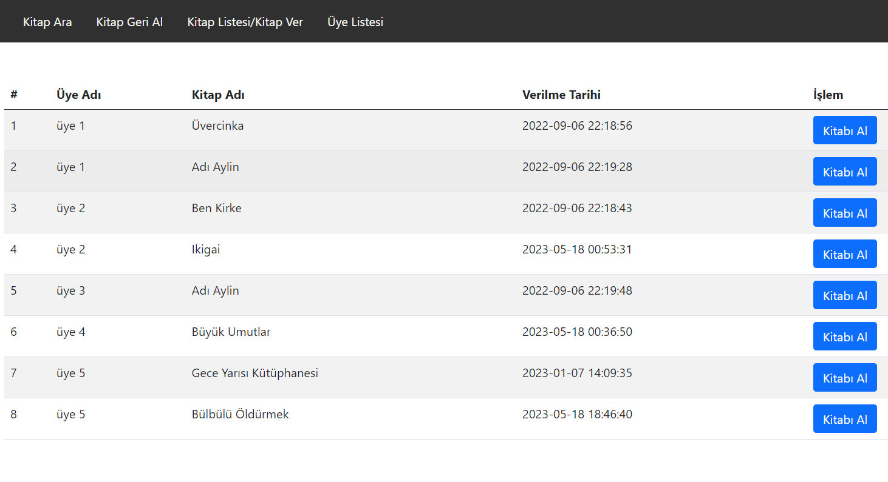

# LibraryAutomationSystem
Kütüphane Otomasyon Sistemi

Kullanılan teknolojiler:
PHP, MYSQL, Apache server, Bootstrap, HTML, CSS, SweetAlert

Kütüphanelerde kullanılmak üzere kitap alış/veriş işlemlerini ve üye işlemlerini gerçekleştirebilecek bir uygulama geliştirilmiştir.

Başlangıçta giriş yapma ekranı bizi karşılamaktadır. sisteme kayıtlı görevlinin giriş bilgileri ile giriş yapılmakta ve ana sayfaya yönlendirilmektedir. Kayıtlı değil ise gerekli bilgilerle kaydolma işlemi gerçekleştirilmektedir.

  
  

Ana sayfada kitap arama, kitap ekleme, kategoriler, kitap verme, kitap alma, üye ekleme, üye listeleme ve kayıtlı görevlileri görüntüleme işlemlerini gerçekleştirmek üzere ilgili alanlar bulunmaktadır.

  

Kitap arama sayfasında kitap adıyla veya yazar adıyla arama yapılabilmektedir.

  

Kitap ekleme bölümünde ilgili bilgiler girilerek kitap sisteme kaydedilebilmektedir. Kategoriler kısmından ise kütüphanede bulunan tüm kitapların kategorileri ve sayıları görüntülenebilmektedir.

Kitap listesi/kitap verme sayfasında kütüphanede bulunan tüm kitaplar listelenmektedir. Bu sayfada kitap ver butonuna basılarak kitabın verileceği üyenin üyelik numarası ile kitap okuyucuya verilebilmektedir. Bir okuyucu aynı anda en fazla iki kitap alabilmekte, 2'den fazla kitap alma işleminde bulunursa sistem uyarmaktadır. Kitap okuyucuya verildikten sonra kitap listesinden ilgili kitabın sayısı bir azalmakta, eğer mevcutta bulunan son kitap verildi ise "kitap okuyucuda" şeklinde sistemde belirtilmektedir. Kitap verme işlemi sırasında kayıtlı olmayan bir üyeye kitap verilmeye çalışılırsa sistem tarafından uyarı gösterilmektedir. 

  
  

  

Kitap geri alma sayfasında, kitap verilen tüm üyeler aldığı kitap ve tarih ile listelenmektedir. İlgili üyeden kitap alma işlemi belirtilen buton ile gerçekleştirilebilmektedir. İşlem gerçekleştikten sonra kitap listesinde ilgili kitabın sayısı güncellenecek ve üye 1 kitap daha alma iznine erişecektir, aynı anda iki kitaba kadar alabilmektedir.

  

Sisteme yeni bir üye kayıt olacağı zaman sistemi kullanan görevli tarafından bu üyelik işlemi gerçekleştirilmekte, üye listesi görüntülenebilmekte, üyelerin bilgileri güncelenebilmekte veya üye silinebilmektedir.
Sistemde kayıtlı görevlileri görüntüleyebilmek için "Görevliler" adlı bir sayfa bulunmaktadır. Burada sisteme giriş yapmış kullanıcı dışındaki diğer kullanıcılar silinebilmektedir.

